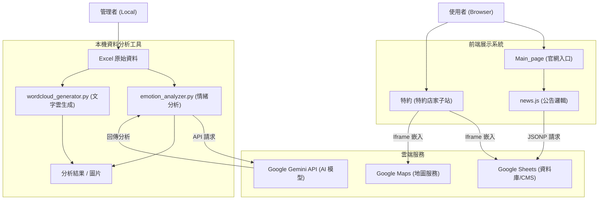
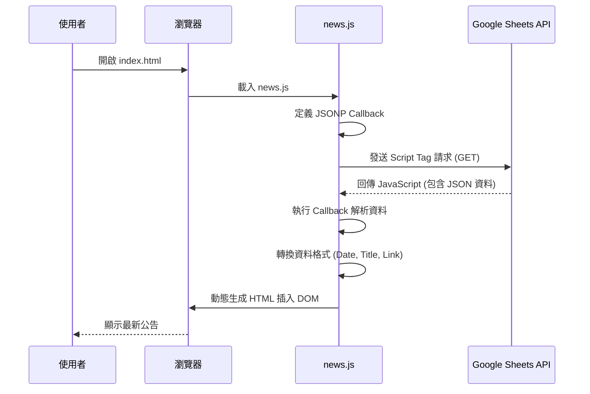
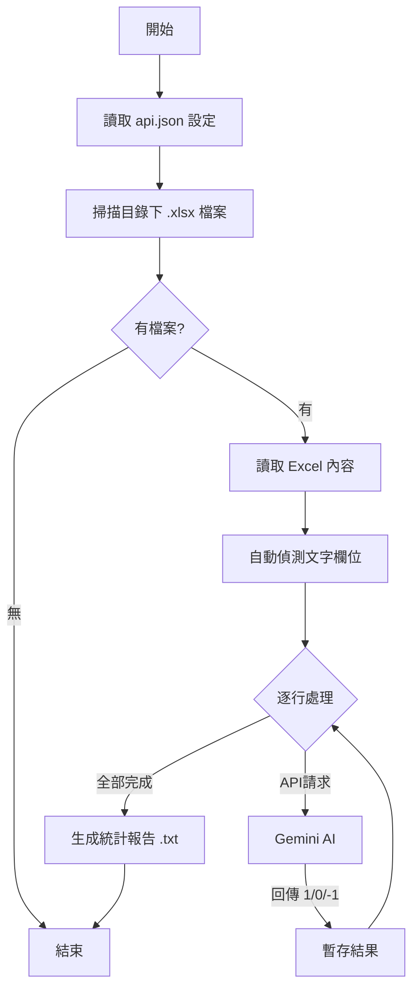

# 國立臺中教育大學學生會官網整合專案 
(NTCU Student Association Integration Project)

## 專案總覽 (Project Overview)
本專案整合了國立臺中教育大學學生會的官方網站前端展示與後端資料分析工具。主要用途為提供學生校園資訊、特約商店查詢，並具備針對學生言論進行情緒分析與關鍵字視覺化的後端工具。

- **解決的問題**：整合分散的公告資訊、提供直觀的特約商店地圖、自動化分析學生意見回饋（言論自由牆）。
- **使用對象**：全校師生（前端）、學生會幹部與工程師（後端分析工具）。
- **專案性質**：混合型專案，包含靜態網站 (Web Client) 與 本機 Python 自動化工具 (Local Automation Tools)。

## 系統架構說明 (Architecture Overview)
本系統分為「前端展示層」與「後端分析層」。

- **前端展示層**：由純 HTML/CSS/JS 構成，直接部署於靜態伺服器。資料面透過 JSONP 與 iframe 技術，直接與 Google Sheets 和 Google Maps 串接，不依賴傳統後端資料庫，降低維護成本。
- **後端分析層**：由 Python 腳本組成的本機工具箱。針對 Excel 格式的原始資料進行處理，並串接 Google Gemini API 進行 AI 情緒判讀，或使用 Jieba 進行斷詞生成文字雲。



## 系統流程說明 (System Flow)

### 1. 前端公告載入流程
網站採用 Client-Side Rendering (CSR) 模式載入公告，利用 Google Sheets 作為輕量級 CMS。



### 2. 情緒分析工具執行流程
管理者在本地端執行 Python 腳本進行輿情分析。



## 資料夾結構說明 (Folder Structure)

```text
Web/SA/
├── README.md               # 本文件
├── Main_page/              # [前端] 官網主系統
│   ├── css/                # 樣式表
│   ├── img/                # 圖片資源
│   ├── js/                 # 腳本邏輯
│   │   └── news.js         # 核心公告載入邏輯
│   ├── index.html          # 首頁
│   ├── all_news.html       # 所有公告頁
│   ├── news_detail.html    # 公告詳情頁
│   └── calendar.html       # 行事曆頁
│
├── 特約/                   # [前端] 特約店家獨立子頁面
│   ├── SA_food.html        # 特約店家首頁
│   ├── script.js           # 簡單的導覽列互動邏輯
│   └── styles.css          # 特約頁面專屬樣式
│
└── 言論自由牆/             # [後端] 資料分析專案
    ├── code/
    │   ├── 情緒分類/       # 情緒分析模組
    │   │   ├── emotion_analyzer.py  # 主程式
    │   │   └── api.json             # API 金鑰設定 (需自行建立)
    │   └── 文字雲/         # 文字雲模組
    │       ├── wordcloud_generator.py # 主程式
    │       └── stopwords.txt          # 停用詞庫
    ├── file/               # 原始資料存放區
    └── result/             # 分析結果產出區
```

## 核心模組與重要檔案 (Key Modules & Files)

### 前端核心
- **`Main_page/js/news.js`**: 
  - **職責**: 負責與 Google Sheets 溝通。
  - **機制**: 使用 JSONP 避開跨域 (CORS) 限制，將試算表資料轉換為網頁公告。
  - **重要變數**: `SHEET_ID` (指向資料來源試算表)。

- **`Main_page/index.html`**:
  - **職責**: 網站入口，包含 Hero Section、最新公告區塊、行事曆嵌入。

### 後端核心 (Python)
- **`emotion_analyzer.py`**:
  - **職責**: 讀取 Excel，呼叫 Google Gemini API 判斷文本情緒 (正向/中性/負向)。
  - **特性**: 具備斷點續傳、自動重試 (Retry) 機制、由 api.json 讀取金鑰。

- **`wordcloud_generator.py`**:
  - **職責**: 使用 `jieba` 進行中文斷詞，移除停用詞後，繪製高解析度文字雲圖片。
  - **特性**: 支援自訂停用詞、自動偵測目錄下 Excel 檔。

## 安裝與環境需求 (Installation & Requirements)

### 1. 網站前端
- **需求**: 任意現代瀏覽器 (Chrome, Edge, Safari)。
- **啟動**: 直接雙擊開啟 `.html` 檔案，或使用 Live Server 預覽。

### 2. Python 分析工具
- **語言版本**: Python 3.8+
- **必要套件**:
  ```bash
  pip install pandas requests openpyxl jieba wordcloud matplotlib numpy pillow
  ```
- **環境變數**: 需在 `言論自由牆/code/情緒分類/` 目錄下建立 `api.json`：
  ```json
  {
      "api_key": "YOUR_GEMINI_API_KEY"
  }
  ```

## 使用方式 (How to Use)

### 瀏覽網站
1. 進入 `Main_page` 資料夾。
2. 開啟 `index.html` 即可瀏覽首頁。
3. 公告資料會自動從 Google Sheets 載入（需連網）。

### 執行情緒分析
1. 將含有文字資料的 `.xlsx` 檔案放入 `言論自由牆/code/情緒分類/` 資料夾。
2. 確認 `api.json` 已設定。
3. 開啟終端機 (Terminal) 切換至該目錄。
4. 執行指令：
   ```bash
   python emotion_analyzer.py
   ```
5. 程式會自動分析並產生 `_情緒分析結果.xlsx` 與 `_統計報告.txt`。

### 產生文字雲
1. 將 `.xlsx` 檔案放入 `言論自由牆/code/文字雲/` 資料夾。
2. 執行指令：
   ```bash
   python wordcloud_generator.py
   ```
3. 程式將輸出 `_文字雲.png` 圖片檔。

## 設定說明 (Configuration)

| 設定檔 | 位置 | 用途 |
|--------|------|------|
| **api.json** | `code/情緒分類/` | 儲存 Google Gemini API Key，格式為 JSON。 |
| **stopwords.txt** | `code/文字雲/` | 定義文字雲排除詞彙（如：的、了、是），一行一詞。 |
| **SHEET_ID** | `Main_page/js/news.js` | 第 6 行，指定公告資料來源的 Google Sheet ID。 |

## 開發者指南 (Developer Guide)

1. **修改公告來源**: 若要更換公告試算表，請確保新試算表權限開啟為「知道連結者皆可檢視」，並更新 `news.js` 中的 `SHEET_ID`。
2. **擴充 AI 模型**: 在 `emotion_analyzer.py` 中可修改 `self.current_model` 變數來切換不同版本的 Gemini 模型 (如 pro/flash)。
3. **文字雲字體**: `wordcloud_generator.py` 預設使用 Windows 系統字體 (`msjh.ttc`)，若在 Mac/Linux 執行需修改字體路徑。

## 已知限制與待辦事項 (Limitations & TODO)

- **[LIMITATION] CORS**: 前端使用 JSONP 抓取 Google Sheets 資料是較舊的技術，未來若 Google 停用相關 API 可能失效，建議遷移至 Google Apps Script 或正式後端。
- **[LIMITATION] API Quota**: 免費版 Gemini API 有每分鐘請求限制，大量資料分析時程式會自動暫停等待，處理速度較慢。
- **[TODO]**: `特約` 頁面的 Google Map 目前為空 iframe，需填入實際 `src` 連結。
- **[TODO]**: `all_news.html` 的分頁功能尚未實作，目前會列出所有資料。

## 補充說明 (Notes)
- 系統中的 `小詠`、`大詠` 為校內宿舍名稱，可能會在 AI 分析時被誤判，提示詞中已加入相關背景知識修正。

